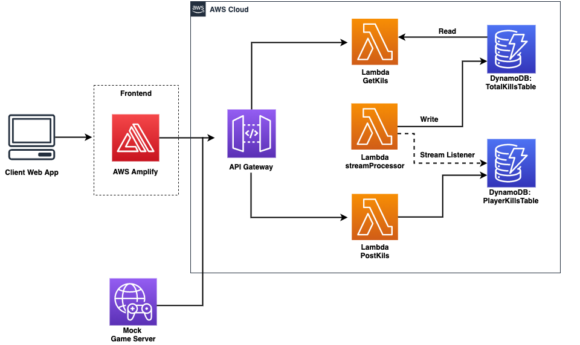

# Cloud Enemy Kill Counter - Backend

Cloud based web service for tracking all accumulated in game player kills transmitted from a mock game server.

The complementary website where players track the community's total kill count can be found below.



[Vision - Problem & Objectives](#vision)

[Architecture & Tech Stack](#tech)

[API Standards](#api)

[Github Project Board](https://github.com/users/gkando/projects/1)

[**Frontend Repo**](https://github.com/gkando/fs-cloud_enemy_counter-fe)

[**Deployed Frontend**](https://master.d1p108p2yx9tvh.amplifyapp.com/)

## Building, Running & Testing

<details>
<summary>Click to expand!</summary>

First install dependencies:

```sh
yarn install
```

To create a production build:

```sh
yarn deploy
```

## Testing

To run unit tests:

```sh
yarn test
```

</details>

## <a name="vision"></a> Vision - Problem & Objectives

### Problem Core

---

Increase community engagement by implementing a cloud based web service and complementary website where players track all accumulated in game kills from every platform. Leaderboards encourage competition among players of your game, and create incentives for the players to get better at the game. Adopting leaderboards allows players to keep up with each other and facilitates building a community. It can also result in players spending more time with the game and higher retention.

---

### Objectives

---

- [x] Source Control - create repos for FE & BE code.
  > github repos listed above.
- [x] Create a basic page as a framework to hold enemy slaying counter.
  > See frontend page.
- [x] Minimally style page with CSS.
  > See frontend page.
- [x] Serve app in the cloud.
  > Hosted using AWS Amplify.
- [x] Configure Amazon CloudFront (or GCP HTTPS load balancer, or Azure CDN etc) to serve site using HTTPS.
  > Hosted using AWS Amplify.
- [x] Use TypeScript to create logic to retrieve enemy kill count from web service.
  > Logic created in React App using Axios to make API calls.
- [x] Store kill count in NoSQL database.
  > Enemy kill count stored in DynamoDB.
- [x] Create an API that accepts HTTP requests and communicates with database.
  > API created using AWS API Gateway.
- [x] Create serverless function using JS:
  - A resource that can be called from an external service to add batches of kills from completed adventures.
  - Some way of being called to report the amount of kills for your app.
    > Lambda functions created to store and retrieve enemy kill count.
- [x] Unit test serverless function and website code.
  > Four unit tests implemented using Jest.
- [x] Infrastructure as Code. _Stretch Goal_
  > Implemented Serverless Framework to convert serverless.yml file to CloudFormation template, bundle and deploy code.
- [x] CI/CD - Set up GitHub Actions to automatically test and deploy backend._Stretch Goal_
  > Created [**Github Action**](https://github.com/gkando/fs-cloud_enemy_counter-be/actions)
  > to deploy repo to CloudFront when code is pushed to master branch.

---

## <a name="tech"></a> Architecture & Tech Stack

### Back-End

- **API:** AWS API Gateway
- **Database:** DynamoDB

  - **PlayerKillsTable**: Individual records of a players total kills submitted by the game server.

  - **TotalKillsTable**: Aggregate sum of the total kills from the PlayerKillsTable.

- **Business Logic:** Lambda function written in JS.

  - **PostKills**: lambda handler function to process batches of new enemy kills.
    - EventParser: Parses post request body to validate it conforms to the expected schema.
    - GameEventService:
      1.  Transforms each item in the submitted in the batch array to a PutRequest object to be submitted to DynamoDB.
      2.  Splits the batch array in to chunks to comply with DynamoDB's maximum batch size limit.
  - DynamoService: Writes each batch of data to the PlayerKillsTable in DynamoDB.

  - **streamProcessor**: Lambda function which listens for new writes to the PlayerKillsTable and updates the TotalKillsTable.

  - **GetKills**: Lambda handler for get endpoint. Retrives total kills from TotalKillsTable and returns it to the client.

- **Testing:** Jest for unit testing.

### Front-End

- **UI:** React framework written in TypeScript using Axios for API calls & CSS for basic styling.
- **Hosting:** AWS Amplify Console to provide a git-based workflow for CD.

---

## <a name="api"></a> API Standards

Standards for interacting with this web service.

## Version: 0.1

### /dev/totals

#### GET

##### Description:

Retrieves the total number of player kills.

##### Responses

| Code | Description                                  |
| ---- | -------------------------------------------- |
| 200  | Returns an object containing the totalKills. |

### /dev/kills

#### POST

##### Description:

Add a new batch of player kills to the total enemy kill counter. API key is required for access. Body must contain an array of objects, each containing a playerId and number of kills.

##### Parameters

| Name      | Located in | Description | Required | Schema |
| --------- | ---------- | ----------- | -------- | ------ |
| x-api-key | header     |             | No       | string |

##### Responses

| Code | Description                                         |
| ---- | --------------------------------------------------- |
| 200  | OK - Batch succesfully added                        |
| 403  | Forbidden - Authentication credentials not provided |

##### Security

| Security Schema | Scopes |
| --------------- | ------ |
| ApiKeyAuth      |        |
